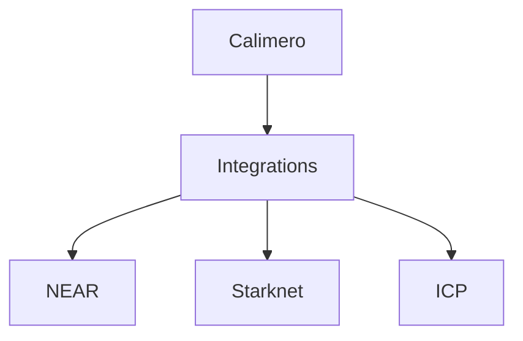
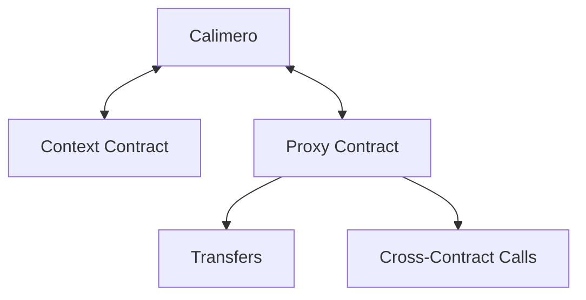
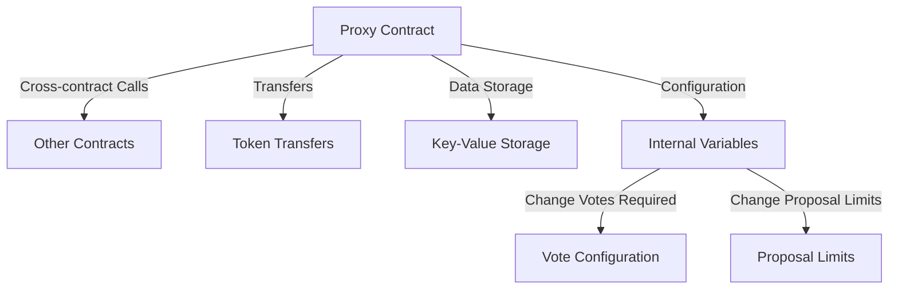
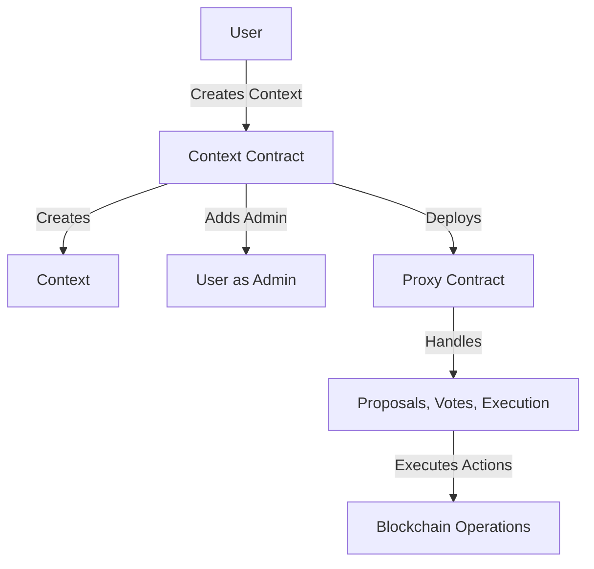
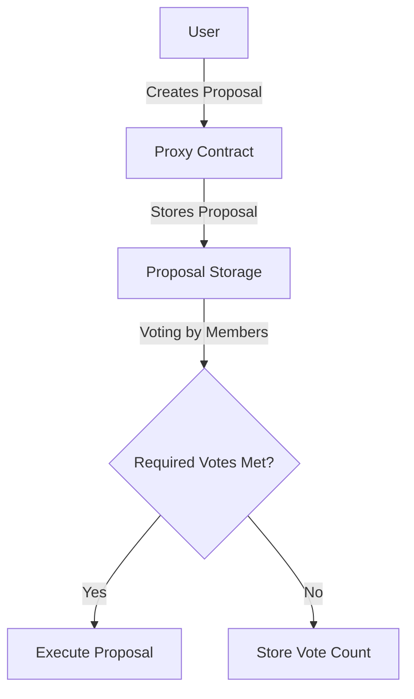
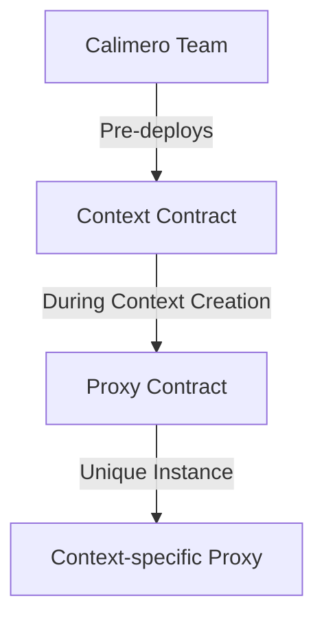
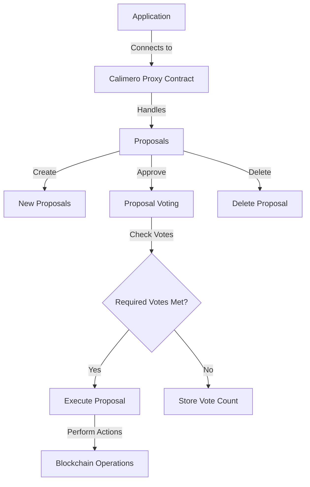

import InitNode from '../shared/node-init.mdx';

# Blockchain Integrations

Calimero offers integration with multiple blockchain protocols, allowing users
to interact with the blockchain and perform read and write operations.

## Current Blockchain Integrations

Calimero currently supports the following blockchain protocols:

- NEAR
- Starknet
- Internet Computer (ICP)

## Operations

- Read
- Read the data from the Calimero contracts.
- Write
- Write data to any contract on the same blockchain protocol through
  cross-contract calls in the Proxy Contract.

## Functionalities

- Cross-contract calls
- Transfers
- Storage of arbitrary data
- Configuration of the internal configuration variables
- Proposal creation and execution

## Functionality Details

- **Cross-contract calls**: Proxy contract allows making cross-contract calls to
  other contracts on the same blockchain protocol. Users need to specify the
  contract address, the method to call, and the arguments for that method.
- **Transfers**: Proxy contract allows transferring tokens to the specified
  address. Users need to specify the recipient address and the amount of tokens
  to transfer.
- **Storage of arbitrary data**: Proxy contract allows storing arbitrary data in
  the context storage. Users need to specify the key and the value for the data
  to be stored.
- **Configuration of the internal configuration variables**: Configure the
  internal configuration variables of the Calimero contracts:
- **Vote configuration**: Number of votes required for a proposals to be
  approved (u32)
- **Proposal limits**: Maximum number of proposals that one user can have at the
  same time(u32)
- **Proposal creation and execution**: Proposals are created by users and
  contain one or multiple actions that are voted on by the users of the context.
  If a proposal is approved, it is automatically executed by the Calimero Proxy
  Contract.

## Calimero Contracts

Calimero integrates two types of contracts for each blockchain protocol:

- Context Contract
- Proxy Contract

### Context Contract

The Context Contract is responsible for creating contexts, adding and removing
members, editing their privileges, and associating specific applications with a
context.

### Proxy Contract

Each context has its own Proxy Contract instance which is deployed during the
context creation.

Tutorial on how to use proxy contract functionalities is available in
[tutorials section](../../tutorials/proxy-contract-interaction)

### Deployment of Contracts

#### Context Contract

Context Contract is predeployed on each blockchain by the Calimero team.

#### Proxy Contract

Proxy Contract is deployed during the context creation.

:::info

Proxy Contract is deployed on the same blockchain as the Context Contract.

:::

:::warning

Users are responsible for funding the Proxy Contract.

:::

### Example Application

We have an example application that connects to Calimero Proxy Contract and
allows creating proposals, voting on them, and executing the approved proposals.

Application showcases all the actions that can be done on the Proxy Contract.

To create context on specific blockchain user will need to add the --protocol
when initializing the node

<InitNode />

Full source code is available in our GitHub
[repository](https://github.com/calimero-network/demo-blockchain-integrations).
