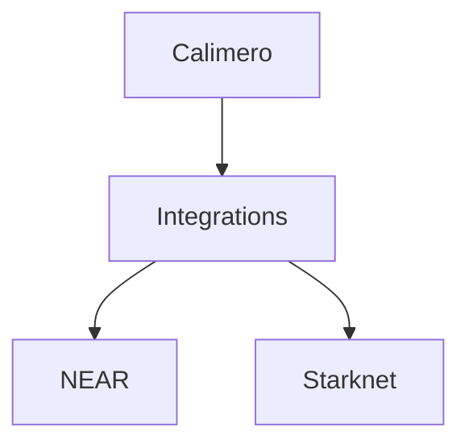
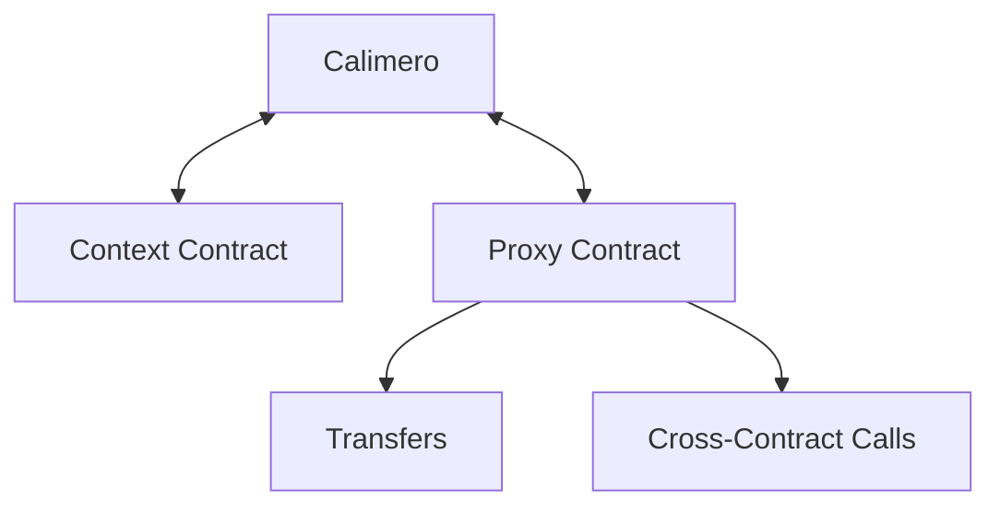
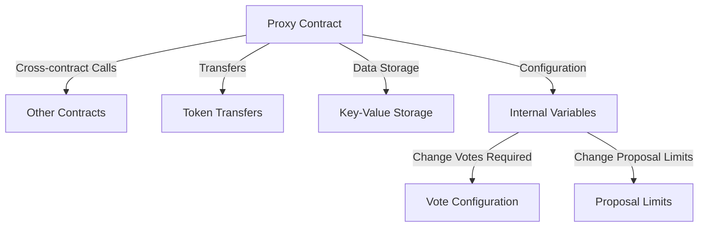
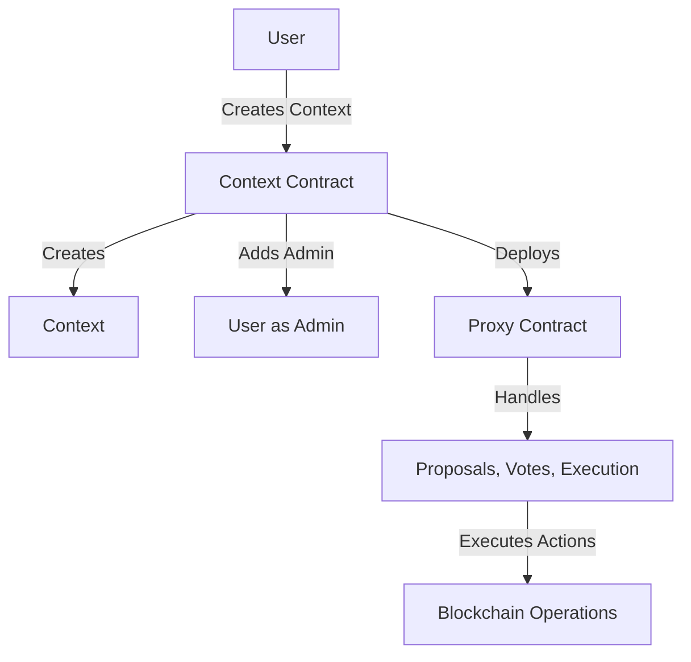
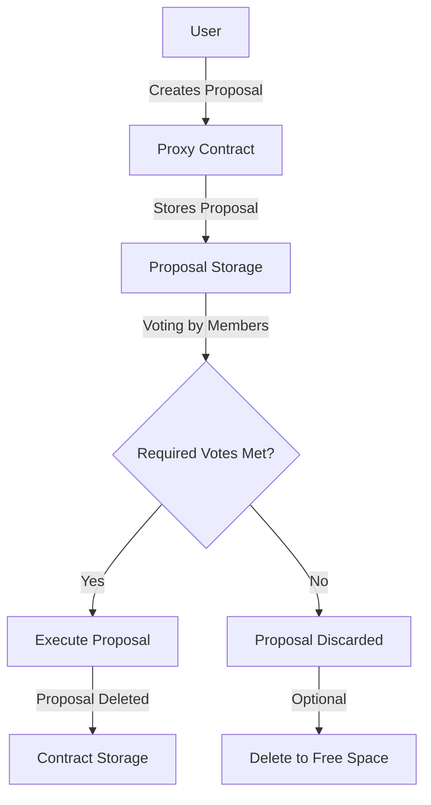
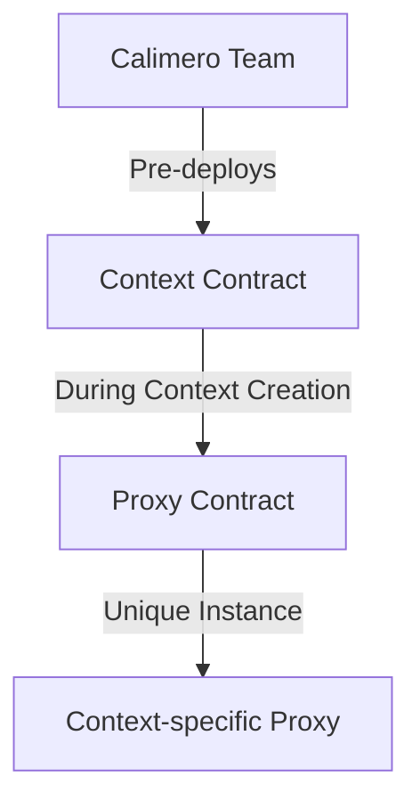
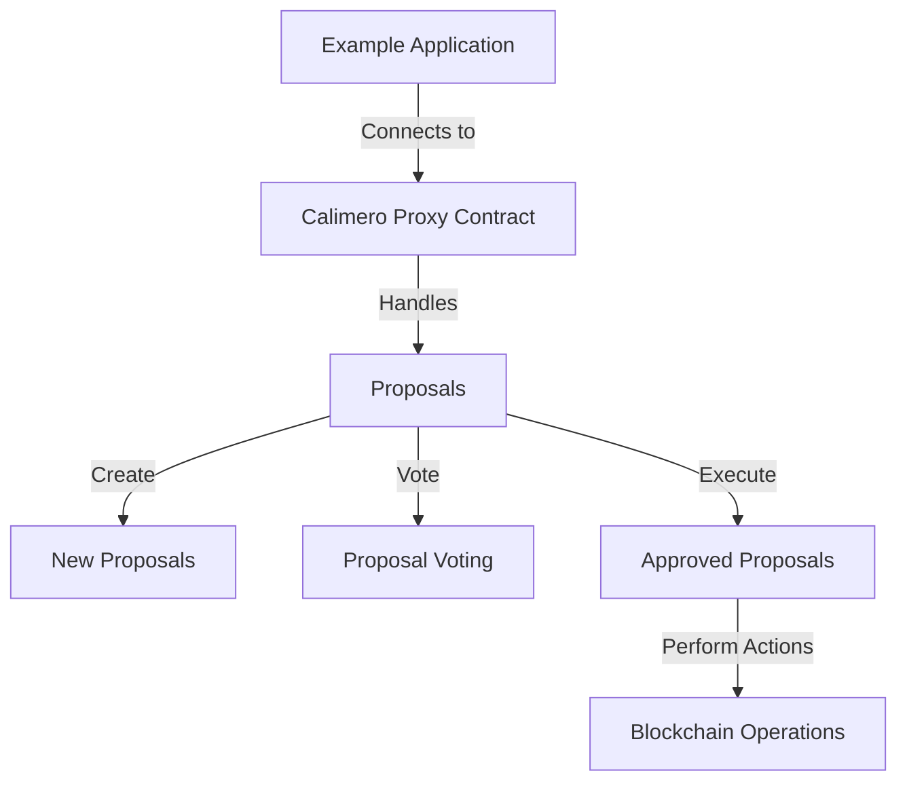

# Blockchain Integrations

Calimero offers integration with multiple blockchain protocols, allowing users to
interact with the blockchain and perform read and write operations.

## Current Blockchain Integrations

Calimero currently supports the following blockchain protocols:

- NEAR
- Starknet

---

## Supported Operations

- Read
  - Read the data from the Calimero contracts.
- Write
  - Write data to any contract on the same blockchain protocol through cross-contract calls in the Proxy Contract.

## Supported Functionalities

- Cross-contract calls
- Transfers
- Storage of arbitrary data
- Configuration of the internal configuration variables
- Proposal creation and execution

---

## Functionality Details

- **Cross-contract calls**: Proxy contract allows making cross-contract calls to
  other contracts on the same blockchain protocol. Users need to specify the contract
  address, the method to call, and the arguments for that method.
- **Transfers**: Proxy contract allows transferring tokens to the specified address.
  Users need to specify the recipient address and the amount of tokens to transfer.
- **Storage of arbitrary data**: Proxy contract allows storing arbitrary data
  in the context storage. Users need to specify the key and the value for the data
  to be stored.
- **Configuration of the internal configuration variables**: Configure the
  internal configuration variables of the Calimero contracts.
- **Proposal creation and execution**: Proposals are created by users and
  contain one or multiple actions that are voted on by the users of the context. If a proposal
  is approved, it is automatically executed by the Calimero Proxy Contract.

---

## Calimero Contracts

Calimero integrates two types of contracts for each blockchain protocol:

- Context Contract
- Proxy Contract

---

### Context Contract

The Context Contract is responsible for creating contexts, adding and removing
members, editing their privileges, and associating specific applications with a
context.

---

### Proxy Contract

Each context has its own Proxy Contract instance which is deployed during the
context creation.

---

### Deployment of Contracts

#### Context Contract
Context Contract is predeployed on each blockchain by the Calimero team.

#### Proxy Contract
Proxy Contract is deployed during the context creation.

---

### Example Application

We have an example application that connects to Calimero Proxy Contract and allows
creating proposals, voting on them, and executing the approved proposals.

---

You can find the example application [here](https://github.com/calimero-network/demo-blockchain-integrations).
