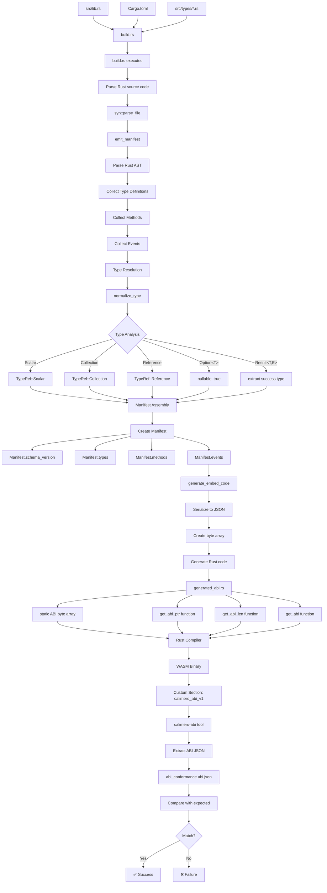

# ABI Build Process

This document explains the detailed build process for ABI generation in Calimero
applications, from source code analysis to WASM binary embedding.

## Overview

The ABI generation process is integrated into the Rust build system and occurs
automatically when you build your application. Here's the complete flow:



## Phase 1: Source Code Analysis

### 1.1 Build Script Execution

The process begins when Cargo executes your `build.rs` file:

```rust
// build.rs
use calimero_abi_emitter::emit_manifest;

fn main() {
    emit_manifest().expect("Failed to generate ABI manifest");
}
```

### 1.2 Source Code Parsing

The emitter uses the `syn` crate to parse your Rust source code:

```rust
use syn::parse_file;

// Parse the main source file
let ast = parse_file(&source_code)?;

// Walk the AST to collect definitions
let mut collector = AbiCollector::new();
collector.visit_file(&ast);
```

### 1.3 AST Traversal

The emitter traverses the Abstract Syntax Tree to collect:

- **Type Definitions**: Structs, enums, and type aliases
- **Method Signatures**: Public methods and their parameters
- **Event Definitions**: Custom events and their payloads
- **Attribute Annotations**: Special ABI configuration attributes

## Phase 2: Type Resolution and Normalization

### 2.1 Type Collection

The emitter collects all type definitions from your source code:

```rust
pub struct AbiCollector {
    types: HashMap<String, TypeDefinition>,
    methods: Vec<MethodDefinition>,
    events: Vec<EventDefinition>,
}

impl AbiCollector {
    fn visit_item_struct(&mut self, item: &ItemStruct) {
        let type_def = TypeDefinition::from_struct(item);
        self.types.insert(type_def.name.clone(), type_def);
    }

    fn visit_item_enum(&mut self, item: &ItemEnum) {
        let type_def = TypeDefinition::from_enum(item);
        self.types.insert(type_def.name.clone(), type_def);
    }
}
```

### 2.2 Type Normalization

Rust types are normalized to ABI-compatible representations:

```rust
pub fn normalize_type(ty: &Type) -> TypeRef {
    match ty {
        // Scalar types
        Type::Path(path) if is_scalar_type(path) => {
            TypeRef::Scalar(scalar_type_from_path(path))
        }

        // Collections
        Type::Path(path) if is_vec_type(path) => {
            let inner = extract_vec_inner_type(path);
            TypeRef::Collection(CollectionType::List(Box::new(normalize_type(inner))))
        }

        // Options
        Type::Path(path) if is_option_type(path) => {
            let inner = extract_option_inner_type(path);
            TypeRef::Option(Box::new(normalize_type(inner)))
        }

        // Results
        Type::Path(path) if is_result_type(path) => {
            let (ok_type, _) = extract_result_types(path);
            TypeRef::Result(Box::new(normalize_type(ok_type)))
        }

        // Structs and enums
        Type::Path(path) if is_custom_type(path) => {
            TypeRef::Reference(path.ident.to_string())
        }

        _ => TypeRef::Unknown,
    }
}
```

### 2.3 Type Mapping

Rust types are mapped to ABI types according to the following rules:

| Rust Type                 | ABI Type                  | Notes             |
| ------------------------- | ------------------------- | ----------------- |
| `u8`, `u16`, `u32`, `u64` | `u8`, `u16`, `u32`, `u64` | Direct mapping    |
| `i8`, `i16`, `i32`, `i64` | `i8`, `i16`, `i32`, `i64` | Direct mapping    |
| `bool`                    | `bool`                    | Direct mapping    |
| `String`                  | `string`                  | UTF-8 string      |
| `Vec<T>`                  | `list<T>`                 | Dynamic array     |
| `[T; N]`                  | `array<T, N>`             | Fixed-size array  |
| `Option<T>`               | `T?`                      | Nullable type     |
| `Result<T, E>`            | `T`                       | Success type only |
| `BTreeMap<K, V>`          | `map<K, V>`               | Key-value mapping |
| `HashMap<K, V>`           | `map<K, V>`               | Key-value mapping |
| `struct S { ... }`        | `record S { ... }`        | Record type       |
| `enum E { ... }`          | `variant E { ... }`       | Variant type      |

## Phase 3: Manifest Creation

### 3.1 Manifest Structure

The ABI manifest is created with the following structure:

```rust
pub struct AbiManifest {
    pub schema_version: String,
    pub types: HashMap<String, TypeDefinition>,
    pub methods: Vec<MethodDefinition>,
    pub events: Vec<EventDefinition>,
    pub metadata: ManifestMetadata,
}

pub struct TypeDefinition {
    pub name: String,
    pub kind: TypeKind,
    pub fields: Vec<FieldDefinition>,
    pub variants: Vec<VariantDefinition>, // For enums
}

pub struct MethodDefinition {
    pub name: String,
    pub input: TypeRef,
    pub output: TypeRef,
    pub is_async: bool,
    pub documentation: Option<String>,
}

pub struct EventDefinition {
    pub name: String,
    pub payload: TypeRef,
    pub documentation: Option<String>,
}
```

### 3.2 Method Collection

Public methods are collected and analyzed:

```rust
impl AbiCollector {
    fn visit_impl_block(&mut self, impl_block: &ItemImpl) {
        for item in &impl_block.items {
            if let ImplItem::Method(method) = item {
                if method.vis == Visibility::Public {
                    let method_def = MethodDefinition::from_method(method);
                    self.methods.push(method_def);
                }
            }
        }
    }
}
```

### 3.3 Event Collection

Events are collected from methods marked with the `#[calimero_event]` attribute:

```rust
impl AbiCollector {
    fn collect_events(&mut self, ast: &File) {
        for item in &ast.items {
            if let Item::Struct(item_struct) = item {
                if has_calimero_event_attr(item_struct) {
                    let event_def = EventDefinition::from_struct(item_struct);
                    self.events.push(event_def);
                }
            }
        }
    }
}
```

## Phase 4: Code Generation and Embedding

### 4.1 ABI Serialization

The manifest is serialized to JSON:

```rust
use serde_json;

pub fn generate_abi_json(manifest: &AbiManifest) -> Result<String, Error> {
    serde_json::to_string_pretty(manifest)
        .map_err(|e| Error::SerializationFailed(e))
}
```

### 4.2 Rust Code Generation

The ABI is embedded as a static byte array in generated Rust code:

```rust
pub fn generate_embed_code(manifest: &AbiManifest) -> String {
    let json = generate_abi_json(manifest).unwrap();
    let bytes = json.as_bytes();

    format!(r#"
        // Generated ABI code - DO NOT EDIT
        const ABI_BYTES: &[u8] = &{:#?};

        pub fn get_abi_ptr() -> *const u8 {{
            ABI_BYTES.as_ptr()
        }}

        pub fn get_abi_len() -> usize {{
            ABI_BYTES.len()
        }}

        pub fn get_abi() -> &'static [u8] {{
            ABI_BYTES
        }}
    "#, bytes)
}
```

### 4.3 File Generation

The generated code is written to a file:

```rust
use std::fs;

pub fn write_generated_abi(manifest: &AbiManifest) -> Result<(), Error> {
    let code = generate_embed_code(manifest);
    fs::write("src/generated_abi.rs", code)?;
    Ok(())
}
```

## Phase 5: WASM Compilation and Embedding

### 5.1 WASM Compilation

The Rust code is compiled to WASM with the embedded ABI:

```bash
cargo build --target wasm32-unknown-unknown --release
```

### 5.2 Custom Section Embedding

The ABI is embedded as a custom section in the WASM binary:

```rust
// During WASM compilation, the ABI is embedded as a custom section
// Section name: "calimero_abi_v1"
// Section content: JSON-encoded ABI manifest
```

### 5.3 Binary Structure

The final WASM binary contains:

- **Standard WASM sections**: Code, data, etc.
- **Custom section**: `calimero_abi_v1` containing the ABI JSON
- **Export functions**: `get_abi_ptr`, `get_abi_len`, `get_abi`

## Phase 6: ABI Extraction and Validation

### 6.1 ABI Extraction

Use the `calimero-abi` tool to extract the ABI:

```bash
calimero-abi extract target/wasm32-unknown-unknown/release/my_app.wasm
```

### 6.2 Validation Process

The extracted ABI is validated against expected schemas:

```rust
pub fn validate_abi(abi_json: &str, expected_schema: &str) -> Result<(), ValidationError> {
    let abi: AbiManifest = serde_json::from_str(abi_json)?;
    let expected: AbiManifest = serde_json::from_str(expected_schema)?;

    // Validate schema version
    if abi.schema_version != expected.schema_version {
        return Err(ValidationError::SchemaVersionMismatch);
    }

    // Validate types
    for (name, expected_type) in &expected.types {
        if let Some(actual_type) = abi.types.get(name) {
            if !types_compatible(actual_type, expected_type) {
                return Err(ValidationError::TypeMismatch(name.clone()));
            }
        } else {
            return Err(ValidationError::MissingType(name.clone()));
        }
    }

    // Validate methods
    validate_methods(&abi.methods, &expected.methods)?;

    // Validate events
    validate_events(&abi.events, &expected.events)?;

    Ok(())
}
```

## Build Configuration

### 6.1 Cargo.toml Configuration

Configure ABI generation in your `Cargo.toml`:

```toml
[package]
name = "my-app"
version = "0.1.0"
edition = "2021"

[build-dependencies]
calimero-abi-emitter = "0.1.0"

[dependencies]
calimero-abi-emitter = "0.1.0"
```

### 6.2 Build Script Configuration

Configure the build script for your specific needs:

```rust
// build.rs
use calimero_abi_emitter::{emit_manifest, AbiConfig};

fn main() {
    let config = AbiConfig {
        protocols: vec![Protocol::Ethereum, Protocol::NEAR],
        include_private_types: false,
        generate_events: true,
        output_format: OutputFormat::Json,
    };

    emit_manifest_with_config(config)
        .expect("Failed to generate ABI manifest");
}
```

## Debugging the Build Process

### 7.1 Enable Debug Logging

Set the `RUST_LOG` environment variable to see detailed build information:

```bash
RUST_LOG=debug cargo build --target wasm32-unknown-unknown --release
```

### 7.2 Inspect Generated Code

Check the generated ABI code:

```bash
cat src/generated_abi.rs
```

### 7.3 Validate ABI Output

Use the ABI tool to inspect the generated ABI:

```bash
calimero-abi extract target/wasm32-unknown-unknown/release/my_app.wasm | jq .
```

## Performance Considerations

### 8.1 Build Time Impact

ABI generation adds minimal overhead to your build process:

- **Source parsing**: ~10-50ms for typical applications
- **Type resolution**: ~5-20ms depending on complexity
- **Code generation**: ~1-5ms for ABI embedding
- **Total overhead**: Usually &lt;100ms for most applications

### 8.2 Binary Size Impact

The embedded ABI adds to your WASM binary size:

- **Typical ABI size**: 1-10KB depending on complexity
- **Compression**: ABI JSON is compressed in the binary
- **Optimization**: Use `cargo build --release` for optimal size

### 8.3 Memory Usage

The ABI is stored as a static byte array:

- **Compile time**: Minimal memory usage during generation
- **Runtime**: Static memory allocation for ABI data
- **Access**: Zero-copy access to ABI data

## Next Steps

Now that you understand the build process:

- [Configuration](./configuration) - Configure ABI generation for your project
- [Rust Integration](./rust-integration) - Integrate ABI generation with your
  Rust code
- [Validation](./validation) - Set up ABI validation and testing
- [Protocol Support](./protocol-support) - Configure support for specific
  protocols
