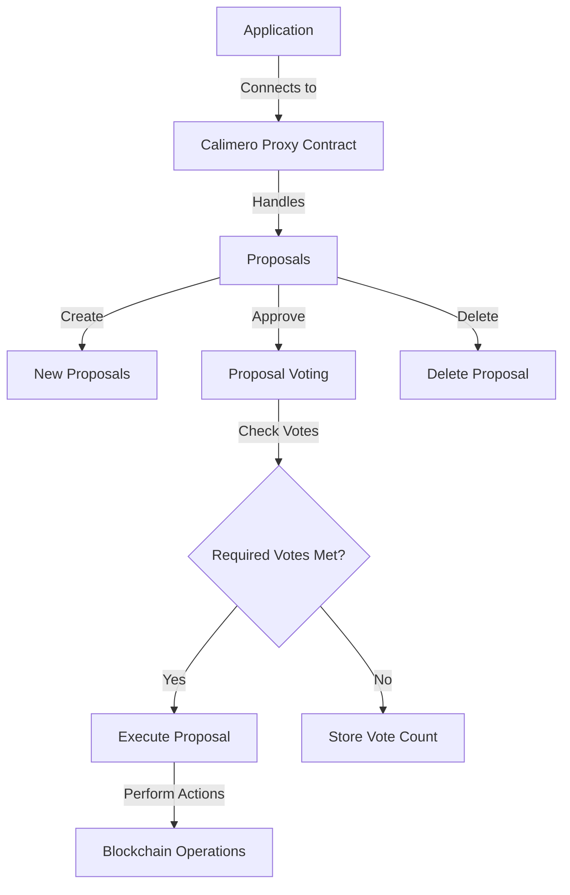

An example application that connects to Calimero Proxy Contract and allows
creating proposals, voting on them, and executing the approved proposals.

Full source code is available in our GitHub
[repository](https://github.com/calimero-network/demo-blockchain-integrations).
